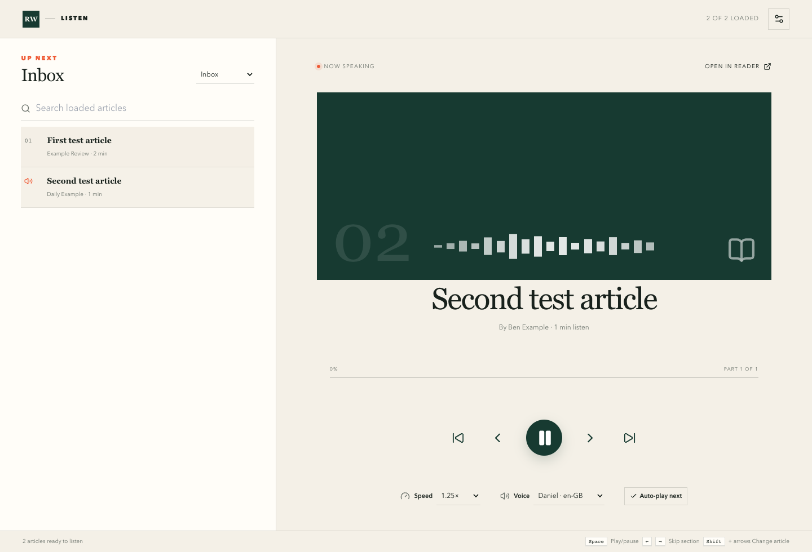

# Readwise Listen 🎧

Listen to your full Readwise Reader articles, one after another, using the voices already built into Brave or Chrome.



## What it does ✨

- Reads the complete article, not only the title or summary.
- Automatically starts the next article.
- Lets you play, pause, skip and change speed or voice.
- Remembers your listening position without saving your Readwise token.
- Runs as a Manifest V3 extension in Brave and Chrome.

## Install it in Brave 🦁

1. Download and unzip the extension from the repository's **Releases** page.
2. Open `brave://extensions`.
3. Switch on **Developer mode**.
4. Press **Load unpacked**.
5. Select the unzipped extension folder.
6. Press the Readwise Listen toolbar icon.

For Chrome, follow the same steps at `chrome://extensions`.

## Start listening ▶️

1. Get your personal token from [Readwise](https://readwise.io/access_token).
2. Paste it into Readwise Listen and press **Connect & load**.
3. Pick an article and press the large play button.
4. Leave **Auto-play next** selected to continue through the queue.

## Token privacy 🔐

- The token box hides what you type and is erased immediately after submission.
- The token is held only in JavaScript memory while the player tab is open.
- It is never saved in source files, logs, URLs, `localStorage`, `sessionStorage` or IndexedDB.
- It is sent only to Readwise in an HTTPS authorization header.
- **Disconnect** cancels pending requests, stops speech, erases the token and resets the player.

Someone who controls your computer or browser developer tools could still inspect live process memory or network traffic. No browser extension can prevent that completely, so Readwise Listen keeps exposure as small as practical.

## Build and test it 🧪

You need Node.js and pnpm:

```sh
pnpm install
pnpm lint
pnpm build
pnpm test
```

The automated tests use fake tokens. They check extension loading, full-text speech, automatic next-article playback, token non-persistence, Disconnect behaviour, cancelled requests, queue race protection and single-tab toolbar behaviour. Tests use Brave on a Mac when it is installed and Playwright Chromium elsewhere.

## Important note ℹ️

This is an independent personal project and is not made or endorsed by Readwise.
